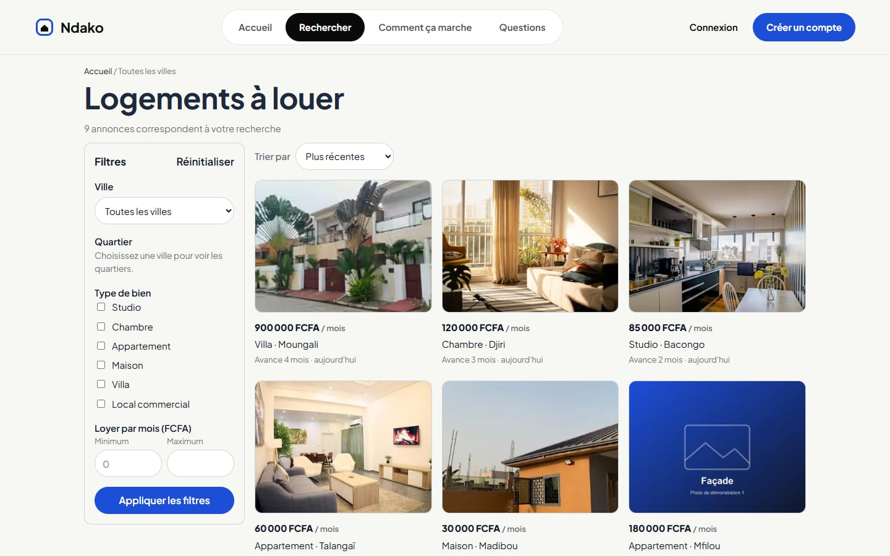
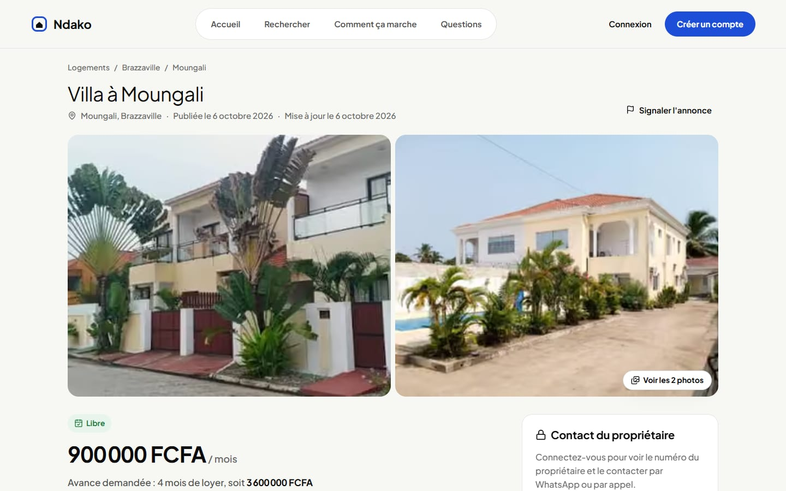
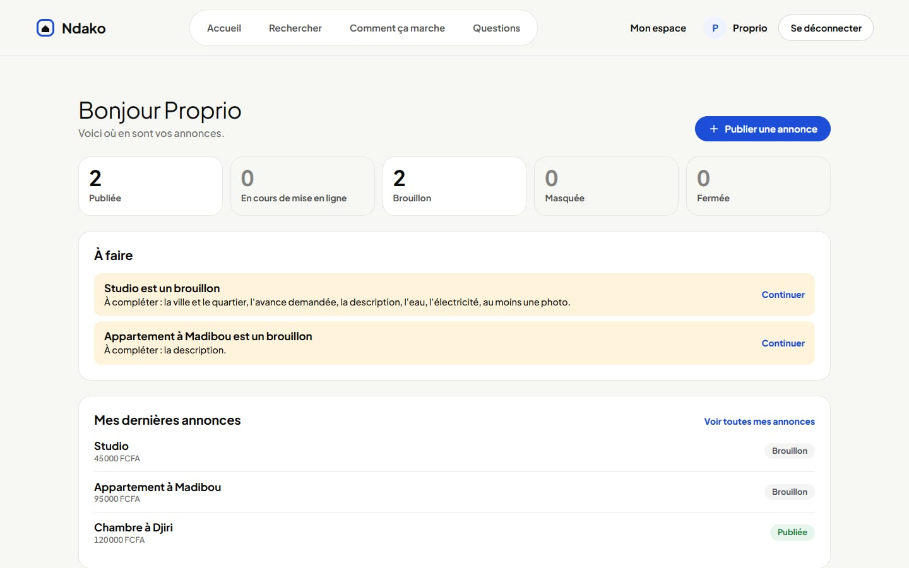
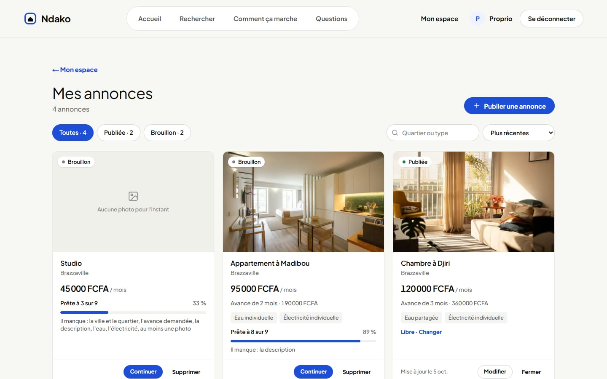
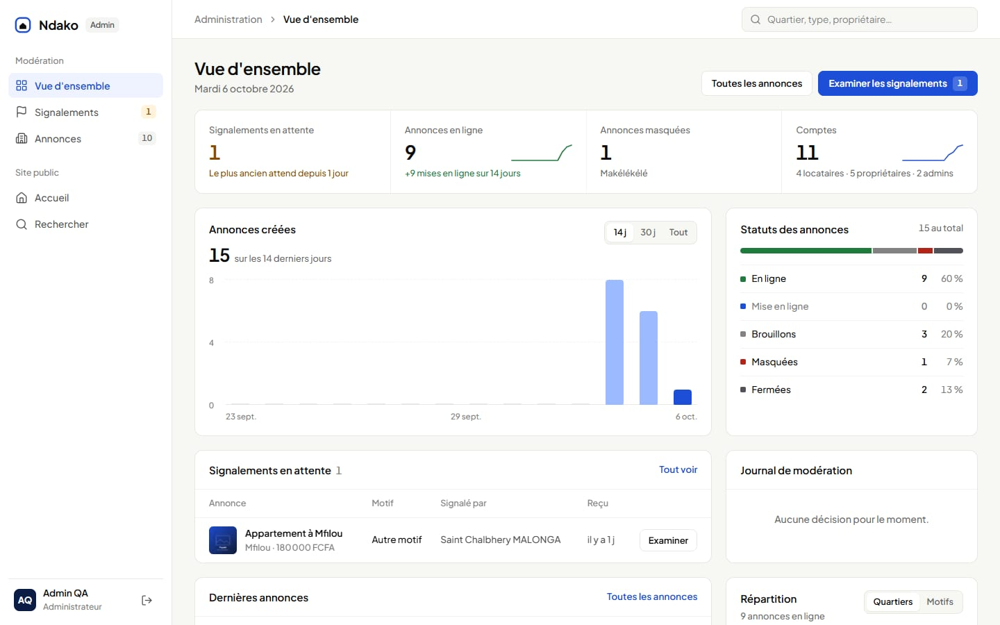

# Ndako : logements à louer à Brazzaville, sans démarcheur

**Ndako** est une plateforme d'annonces de logements à louer à Brazzaville. Les propriétaires publient eux-mêmes leurs logements. Les locataires les trouvent selon leur budget, leur quartier et le type de bien, voient le loyer, l'avance, l'eau, l'électricité et la disponibilité avant de se déplacer, puis appellent le propriétaire ou lui écrivent sur WhatsApp, sans intermédiaire.

Le produit réunit trois espaces dans une même application :

- **Le site public** : accueil, recherche avec filtres et fiche de chaque annonce.
- **L'espace propriétaire** : tableau de bord, publication et gestion des annonces.
- **L'espace administration** : modération des annonces et traitement des signalements.

Projet réalisé par la **Squad 8** pendant l'Évaluation 2 (Sprint Produit en Squad) d'Akieni Academy, promotion 2026.

Application : Next.js 16 (frontend et backend dans le même projet), base de données PostgreSQL sur Supabase.

**Démo en ligne :** https://ndako-squad8.vercel.app/

## Aperçu

**Accueil** : recherche par type de bien et budget, dernières annonces, fonctionnement, témoignages et questions fréquentes.


**Recherche** : filtres par ville, quartiers, type de bien et loyer, tri et pagination.



**Fiche annonce** : photos, loyer, avance calculée, équipements, disponibilité et contact du propriétaire réservé aux comptes connectés.



**Mon espace (propriétaire)** : nombre d'annonces par statut et actions à faire.



**Mes annonces** : une carte par annonce avec son statut, sa progression si c'est un brouillon et ses actions.



**Administration** : indicateurs, annonces créées, statuts, signalements en attente et journal de modération.



**Sur mobile** : l'interface est pensée d'abord pour le téléphone, utilisable dès 360 px de large.


## Le problème

À Brazzaville, chercher un logement à louer est long et coûteux. Les entretiens menés pendant la Discovery font ressortir quatre difficultés :

- la recherche est épuisante, les offres sont dispersées ;
- les déplacements avec un démarcheur coûtent cher, et sur place la maison ne ressemble pas à ce qui était annoncé ;
- les locataires veulent joindre directement le propriétaire ;
- il n'existe pas d'espace structuré avec des informations fiables.

Recourir à un démarcheur oblige aussi à lui payer un mois de loyer en plus. Ndako centralise les offres, affiche les informations essentielles sur chaque logement et met le locataire en relation directe avec le propriétaire.

La réservation finale du logement et le paiement de la caution se font directement avec le propriétaire, **en dehors de la plateforme**.

## Fonctionnalités livrées

| Module | Ce qui est disponible |
| --- | --- |
| **Accueil (landing page)** | Recherche par type de bien et budget vers la page de résultats, dernières annonces publiées, présentation du fonctionnement, galerie, témoignages, questions fréquentes, pages Conditions d'utilisation et Confidentialité |
| **Comptes et accès (AUTH)** | Inscription avec choix du rôle (locataire ou propriétaire) et numéro WhatsApp obligatoire, connexion par e-mail et mot de passe, déconnexion, session fermée après 7 jours sans activité, pages réservées selon le rôle, retour sur la page de départ après connexion ou inscription, en-tête adapté au rôle |
| **Recherche (REC)** | Filtres par ville, quartiers, type de bien et loyer minimum et maximum, filtres actifs affichés, tri par date ou par prix, pagination par 9, message quand rien ne correspond |
| **Fiche annonce (FIC)** | Galerie de photos, loyer, avance en mois et en FCFA, type, quartier, description, eau, électricité, nombre de portes, disponibilité, dates de publication et de mise à jour, contact par WhatsApp ou appel pour les comptes connectés, signalement avec un motif, page « annonce indisponible » |
| **Annonces du propriétaire (ANN)** | Création d'un brouillon, 1 à 8 photos, aperçu pendant la saisie, liste de contrôle avant publication, publication visible des locataires 5 minutes plus tard, modification, disponibilité Libre ou Bientôt libre, fermeture (Loué ou Retirée), suppression, page Mes annonces (cartes, filtres par statut, recherche, tri), tableau de bord « Mon espace » |
| **Administration et modération (ADM)** | Vue d'ensemble (indicateurs, graphique des annonces créées, répartition des statuts, signalements en attente, journal de modération, dernières annonces), liste des annonces en ligne et masquées avec recherche, masquage avec motif obligatoire et réaffichage, signalements à traiter, traités et rejetés, page de traitement d'un signalement |

Il n'y a **pas de validation préalable** des annonces : la fiabilité repose sur la date de mise à jour visible, le signalement par les locataires et la modération par l'administrateur.

### Prévu mais non livré

Ces User Stories « Should » et « Could » du backlog n'ont pas été développées pendant le sprint :

- visites : créneaux, demande, confirmation, annulation et suivi (US-16 à US-21) ;
- avis après une visite, contestation et arbitrage (US-22, US-23) ;
- notifications dans l'application ;
- gestion des utilisateurs par l'administrateur : suspension et réactivation (US-25) ;
- filtres par eau, électricité et disponibilité (US-27) ;
- réinitialisation du mot de passe (US-28).

Hors MVP : agences et démarcheurs, paiement en ligne et Mobile Money, réservation finale du logement, notifications SMS et e-mail, carte, favoris.

## Lancer le projet en local

**Prérequis** : Node.js 22 ou plus, npm 10 ou plus, Git et un projet Supabase (l'offre gratuite suffit).

**1. Récupérer le projet et installer les dépendances**

```bash
git clone https://github.com/Christ-Moungabio/logement-direct.git
cd logement-direct
npm install
```

**2. Renseigner les variables d'environnement**

```bash
cp .env.example .env.local
```

| Variable | Rôle | Où la trouver |
| --- | --- | --- |
| `NEXT_PUBLIC_SUPABASE_URL` | URL du projet Supabase | Supabase : Project Settings, API |
| `NEXT_PUBLIC_SUPABASE_PUBLISHABLE_KEY` | Clé publique (`sb_publishable_…`), utilisée avec la session de l'utilisateur | Supabase : Project Settings, API Keys |
| `SUPABASE_SECRET_KEY` | Clé secrète (`sb_secret_…`), côté serveur uniquement : inscription et script de seed | Supabase : Project Settings, API Keys |
| `DATABASE_URL` | Chaîne de connexion PostgreSQL, pour appliquer les migrations | Supabase : Connect |
| `NEXT_PUBLIC_SITE_URL` | Facultatif : URL publique du site, utilisée dans les messages WhatsApp | URL de production |
| `DEMO_TENANT_PASSWORD`, `DEMO_OWNER_PASSWORD`, `DEMO_ADMIN_PASSWORD` | Mots de passe des comptes de démonstration, lus par le seed (12 caractères minimum) | Valeurs du tableau « Comptes de démonstration » ; celui de l'administrateur est communiqué par l'équipe |

Les fichiers `.env` et `.env.local` ne sont **jamais** commités. La clé `SUPABASE_SECRET_KEY` contourne la sécurité de la base : elle reste côté serveur et ne porte jamais le préfixe `NEXT_PUBLIC_`.

**3. Créer la base de données**

Appliquer, dans l'ordre, les fichiers de `supabase/migrations/`, soit dans le SQL Editor de Supabase, soit avec la CLI :

```bash
npx supabase db push --db-url "<DATABASE_URL>"
```

**4. Charger les données de démonstration**

```bash
npm run db:seed
```

**5. Lancer le site**

```bash
npm run dev
```

Le site est disponible sur http://localhost:3000.

### Comptes de démonstration

Ils sont créés par `npm run db:seed`. On se connecte sur `/connexion` avec l'adresse e-mail et le mot de passe.

| Rôle | E-mail | Mot de passe | Arrive sur |
| --- | --- | --- | --- |
| Locataire | `locataire@ndako.cg` | `Ndako-Locataire-2026` | `/recherche` |
| Propriétaire | `proprietaire@ndako.cg` | `Ndako-Proprio-2026` | `/espace` |
| Administrateur | `admin@ndako.cg` | communiqué par l'équipe | `/admin` |

> Les mots de passe locataire et propriétaire servent à tester le site. Celui de l'administrateur n'est pas écrit dans le dépôt : l'équipe le communique, et le seed le lit dans `.env.local`. Le compte administrateur ne peut pas être créé depuis l'inscription publique.

### Commandes

| Commande | Description |
| --- | --- |
| `npm run dev` | Serveur de développement |
| `npm run build` | Construction pour la production |
| `npm run start` | Lancement de la version construite |
| `npm run lint` | Vérification du code (ESLint) |
| `npm run db:seed` | Données de démonstration (rejouable) |

## Structure du dépôt

```
logement-direct/
├── app/                          Pages (App Router) et design system (globals.css)
│   ├── page.js                   Accueil
│   ├── (auth)/                   Connexion, inscription
│   ├── recherche/                Résultats de recherche
│   ├── annonces/[id]/            Fiche annonce
│   ├── espace/                   Tableau de bord du propriétaire
│   ├── mes-annonces/             Mes annonces, création, modification
│   ├── admin/                    Vue d'ensemble, annonces, signalements
│   └── conditions/, confidentialite/
├── components/                   En-tête, pied de page, cartes, sections de l'accueil, boutons
├── lib/                          Constantes, formatage (FCFA, dates), liens WhatsApp
├── src/
│   ├── features/                 Une fonctionnalité = un dossier
│   │   ├── accueil/              Données de l'accueil
│   │   ├── auth/                 Inscription, connexion, session, rôles
│   │   ├── recherche/            Filtres, tri, pagination
│   │   ├── annonces/             Fiche annonce, contact, signalement
│   │   ├── listing-form/         Création et modification d'une annonce, photos
│   │   ├── listings/             Mes annonces, statuts, disponibilité
│   │   ├── tableau-de-bord/      Mon espace (propriétaire)
│   │   └── moderation/           Administration et modération
│   └── lib/supabase/             Clients Supabase (serveur, navigateur, admin)
├── supabase/migrations/          Schéma de la base (SQL)
├── scripts/seed.mjs              Données de démonstration
├── proxy.js                      Session et pages protégées
├── docs/                         Captures du README
└── README.md
```

Chaque dossier de `src/features/` regroupe ses lectures (`queries.js`), ses Server Actions (`actions.js`), ses schémas de validation (`schemas.js`) et ses composants avec leur CSS Module.

## Stack technique

| Domaine | Technologie |
| --- | --- |
| Framework | Next.js 16 (App Router, Server Components, Server Actions), React 19, JavaScript |
| Base de données | PostgreSQL sur Supabase, sécurisé par la Row Level Security (RLS) |
| Authentification | Supabase Auth (e-mail et mot de passe) |
| Photos | Supabase Storage (bucket public `listing-photos`) |
| Tâches planifiées | `pg_cron` : mise en ligne après 5 minutes, passage automatique à « Libre » |
| Validation | Zod |
| Interface | CSS Modules, police Plus Jakarta Sans, icônes Lucide |
| Qualité | ESLint |
| Hébergement | Vercel |

Il n'y a pas de backend séparé : les pages lisent les données côté serveur et les modifications passent par des Server Actions. Toutes les requêtes utilisent la session de l'utilisateur, et la base refuse ce que son rôle ne permet pas.

## Tests

Le projet n'a pas de tests automatisés. Avant une Pull Request :

```bash
npm run lint
npm run build
```

Puis les parcours concernés sont testés dans le navigateur avec un compte de chaque rôle, sur ordinateur et sur mobile.

## Règles de gestion appliquées

Les règles viennent de la SPEC. Elles sont vérifiées côté serveur, et la base les impose aussi (RLS, contraintes et triggers).

| Règle | Description |
| --- | --- |
| RG-01 | Un numéro WhatsApp = un compte. Le rôle est choisi à l'inscription. Le compte administrateur n'est jamais créé depuis l'inscription publique. |
| RG-02 | Mot de passe de 8 caractères minimum, stocké haché. La session expire après 7 jours sans activité. |
| RG-03 | Une annonce appartient à un seul propriétaire, seul habilité à la modifier, la fermer ou la supprimer. L'administrateur peut la masquer. |
| RG-04 | Pour publier : au moins une photo, type de bien, ville, quartier, loyer, avance, description, eau, électricité et disponibilité. Le nombre de portes est facultatif. |
| RG-05 | 1 à 8 photos par annonce, JPG, PNG ou WebP, 5 Mo maximum chacune. La première est la photo principale. |
| RG-06 | Loyer entier supérieur à 0, en FCFA par mois. Avance de 1 à 6 mois. Le montant de l'avance est calculé et affiché. |
| RG-07 | Types de bien fixes : studio, chambre, appartement, maison, villa, local commercial. Les quartiers dépendent de la ville. |
| RG-08 | Cycle de vie : Brouillon, En cours de mise en ligne (5 minutes), Publiée, Fermée. Une annonce publiée peut être Masquée par l'administrateur. |
| RG-09 | Seules les annonces publiées apparaissent dans la recherche et sur la fiche publique. |
| RG-10 | Modifier une annonce publiée, changer sa disponibilité ou la fermer prend effet immédiatement, sans validation. |
| RG-12 | Disponibilité : Libre, ou Bientôt libre avec une date future obligatoire. Une fois la date atteinte, l'annonce s'affiche Libre. |
| RG-13 | Le numéro du propriétaire n'est visible que par un utilisateur connecté. Il n'est jamais envoyé au navigateur d'un visiteur. |
| RG-14 | La réservation et la caution se règlent avec le propriétaire, hors plateforme. La mention est affichée sur la fiche et sur l'accueil. |
| RG-19 | Résultats triés par défaut du plus récent au plus ancien, 9 par page. |
| RG-20 | Pas de validation préalable. L'administrateur masque une annonce avec un motif obligatoire. Le propriétaire voit le statut Masquée et le motif, et ne peut pas la republier lui-même. |
| RG-21 | Après le clic sur Publier, l'annonce n'est visible des locataires qu'après 5 minutes. Pendant ce délai, le propriétaire peut encore la modifier ou la retirer. |

## Jeu de données

`npm run db:seed` crée :

- les 3 comptes de démonstration (locataire, propriétaire, administrateur) ;
- 7 annonces du propriétaire de démonstration à Brazzaville, avec leurs photos : 4 en ligne, 1 brouillon, 1 fermée et 1 masquée ;
- la ville de Brazzaville, ses quartiers et les types de bien sont créés par la migration initiale.

Le script est rejouable : il ne supprime que les annonces, photos et signalements des comptes de démonstration.

## Pages de l'application

| Page | Accès | Module |
| --- | --- | --- |
| `/` | Tout le monde | Accueil |
| `/connexion`, `/inscription` | Visiteur | AUTH |
| `/conditions`, `/confidentialite` | Tout le monde | Accueil |
| `/recherche` | Tout le monde | REC |
| `/annonces/[id]` | Tout le monde (contact réservé aux comptes connectés) | FIC |
| `/espace` | Propriétaire | ANN |
| `/mes-annonces`, `/mes-annonces/nouvelle`, `/mes-annonces/[id]/modifier` | Propriétaire | ANN |
| `/admin` | Administrateur | ADM |
| `/admin/annonces` | Administrateur | ADM |
| `/admin/signalements`, `/admin/signalements/[id]` | Administrateur | ADM |

Un visiteur qui ouvre une page protégée est envoyé vers la connexion, puis ramené sur la page demandée. Un compte qui n'a pas le bon rôle est renvoyé vers son propre espace.

## Équipe et répartition des tâches

Ce document sert de base à la **note individuelle**. Le produit final donne la **note collective**.

### Rôles de l'équipe

| Personne | Rôle |
| --- | --- |
| **Destinée Consola MABOUMBA NIANGOU** | Product Manager |
| **Lucrèce Fabert MVOULA GUIMBI** | Business Analyst |
| **Saint Chalbhery MALONGA** | Lead Fullstack (+ Fullstack) |
| **Christ-Henoc MOUNGABIO** | Repo Admin (+ Fullstack) |
| **Clairline MBOUMALOKO KALLA** | Fullstack |
| **Samuel Dorval De Francis NDINGA** | Fullstack |

### Product Management et Business Analysis

| Personne | Livrables |
| --- | --- |
| **Destinée Consola MABOUMBA NIANGOU** (PM) | Discovery : entretiens utilisateurs, insights, problème central, vision produit, proposition de valeur, cibles, priorisation RICE et périmètre du MVP |
| **Lucrèce Fabert MVOULA GUIMBI** (BA) | SPEC (acteurs, parcours, règles de gestion, données, exigences non fonctionnelles), FRD, User Stories et critères d'acceptation, backlog priorisé (MoSCoW) et plan de livraison |

### Répartition Fullstack

Chaque développeur a pris un module de la SPEC.

| Développeur | Modules | Pages | Dossiers principaux | Pull Requests |
| --- | --- | --- | --- | --- |
| **Saint Chalbhery MALONGA** | AUTH, Accueil, ADM | `/`, `/connexion`, `/inscription`, `/conditions`, `/confidentialite`, `/admin`, `/admin/annonces`, `/admin/signalements` | `src/features/auth`, `src/features/accueil`, `src/features/moderation`, `components/home`, `components/Header*`, `proxy.js` | #13 à #18, #20, #21, #26, #33 à #36, #41, #49 à #53, #69 à #73, #78, #79, #81, #84 |
| **Christ-Henoc MOUNGABIO** | ANN, schéma de la base | `/espace`, `/mes-annonces`, `/mes-annonces/nouvelle`, `/mes-annonces/[id]/modifier` | `supabase/migrations` (schéma initial), `src/features/listing-form`, `src/features/listings`, `src/features/tableau-de-bord` | #2, #23, #24, #37, #38, #54 |
| **Clairline MBOUMALOKO KALLA** | REC | `/recherche` | `src/features/recherche`, `components/SearchResultCard*` | #22, #61, #82 |
| **Samuel Dorval De Francis NDINGA** | FIC, socle du projet | `/annonces/[id]` | `src/features/annonces`, `scripts/seed.mjs` | #19 |

**Travail transverse :**

- **Saint Chalbhery MALONGA** (Lead Fullstack) : design system et police Plus Jakarta Sans (#48), défilement lors des changements de page (#68), nettoyage du dépôt (#75), revue des Pull Requests de l'équipe.
- **Christ-Henoc MOUNGABIO** (Repo Admin) : dépôt GitHub et accès de l'équipe, application des migrations sur Supabase.
- **Samuel Dorval De Francis NDINGA** : mise en place du socle initial du projet, script de données de démonstration, premier README.

## Contraintes techniques respectées

- **Droits vérifiés côté serveur** à chaque action, et imposés une seconde fois par la base (RLS, triggers).
- **Clé secrète Supabase** utilisée uniquement côté serveur (`src/lib/supabase/admin.js`, protégé par `server-only`) et par le seed.
- **Numéro du propriétaire** lu seulement pour un utilisateur connecté (fonction `get_listing_contact`).
- **Aucun secret dans le dépôt** : variables dans `.env.local`, mot de passe du compte administrateur partagé hors du dépôt.
- **Interface mobile d'abord**, en français, montants au format `150 000 FCFA`, fuseau horaire de Brazzaville.
- **Schéma versionné** : toute évolution de la base passe par un nouveau fichier dans `supabase/migrations/`.

## Organisation du travail

- `main` : branche stable pour la démonstration, sans push direct.
- `dev` : branche d'intégration, alimentée uniquement par Pull Request.
- Une branche par issue : `feature/<issue>-<description>`, `fix/<issue>-<description>`.
- Une Pull Request par fonctionnalité, liée à son issue (`Closes #n`), relue et approuvée par un autre membre avant le merge.
- Commits courts au format `type(zone): description`, par exemple `feat(admin): …`, `fix(inscription): …`.

## Documentation

Le **Product Package** de la Squad est dans le [dossier partagé](https://drive.google.com/drive/folders/1o8Vm30g8IOk1V5PcuonpkK2UyoHFVHqe) :

| Document | Contenu |
| --- | --- |
| Discovery NDAKO | Entretiens, insights, problème, vision, proposition de valeur, priorisation RICE, MVP |
| SPEC : Spécification fonctionnelle | Cadrage, acteurs, périmètre, parcours, règles de gestion, données, exigences non fonctionnelles |
| FRD : Exigences fonctionnelles | Exigences par module (AUTH, REC, FIC, ANN, ADM…) avec leur priorité |
| User Stories et critères d'acceptation | US-01 à US-28 |
| Backlog et plan de livraison | Backlog priorisé, points, dépendances et lots |

## Démo (soutenance)

Scénario type sur https://ndako-squad8.vercel.app/, à partir des parcours de la SPEC :

1. **Trouver un logement** : depuis l'accueil, lancer une recherche, affiner par quartier et loyer, ouvrir une fiche, se connecter avec le compte locataire et contacter le propriétaire par WhatsApp.
2. **Publier un logement** : se connecter avec le compte propriétaire, créer une annonce avec ses photos, la publier, puis la voir apparaître dans la recherche 5 minutes plus tard.
3. **Gérer ses annonces** : changer la disponibilité d'une annonce, puis fermer une annonce louée.
4. **Modérer** : signaler une annonce avec le compte locataire, puis se connecter avec le compte administrateur, ouvrir le signalement et masquer l'annonce avec un motif. Le propriétaire voit le statut Masquée et le motif dans Mes annonces.
